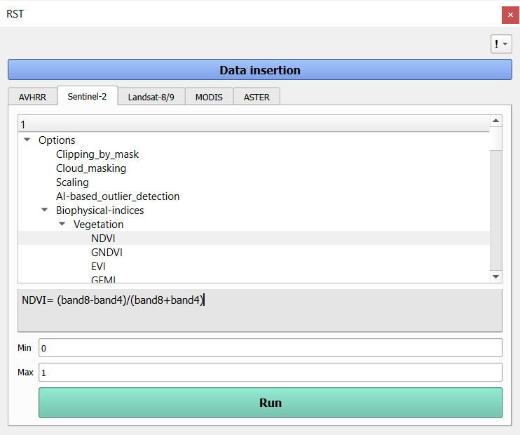

# Remote Sensing Toolkit (RST) — QGIS Plugin

The Remote Sensing Toolkit (RST) is an open-source QGIS plugin designed to streamline the pre-processing and analysis of satellite imagery, particularly in time series studies. It provides an intuitive interface, supports multiple satellite platforms (AVHRR, MODIS, Landsat 8/9, Sentinel-2, and ASTER), and includes over 100 biophysical indices across different categories such as vegetation, water, soil, burn, and buildings. RST also offers powerful pre-processing features, including cloud masking, raster clipping by mask layer, band scaling, and an AI-based outlier detector. This makes it suitable for both novice and expert users working with remote sensing data.

---

## ⚙️ Installation

### 1. Install QGIS
Download and install QGIS (Minimum version=3) from the [official QGIS website](https://qgis.org).

### 2. Install the Plugin
To install RST, one of two options can be used:

**Option A:** From QGIS Plugin Manager 
- Open QGIS → *Plugins* → *Manage and Install Plugins*
- Search for **RST**
- Click **Install**

**Option B:** Manual Installation  
- Download the plugin from the [GitHub repository](https://github.com/RST-Plugin/RST)
- In QGIS: *Plugins* → *Install from ZIP* → Select the downloaded file

 
---

## 🧰 RST Features & Workflow

The RST provides a structured and intuitive workflow for satellite image pre-processing and biophysical index computation. The interface guides the user through a step-by-step process, starting from satellite selection to result generation, supporting both manual and batch processing modes.
 

**1. Select a satellite**
Choose from supported platforms: AVHRR, MODIS, Sentinel-2, Landsat-8, or ASTER

**2. Choose a processing option**
Based on the satellite, the user selects one of the following tools:
  - Cloud masking using QA bands
  - Clipping by vector mask layer
  - Band scaling
  - AI-based outlier detection (using time series from CSV files)
  - Biophysical index computation (100+ indices categorized by satellite and application)

**3. Input data**
Depending on the selected option, the user provides required data via:
  - File Selection (organized file folders)
  - Manual Selection (file-by-file input)

**4. Define output settings**
  - Select an output folder
  - (Optional) Check the Statistics box to generate summaries: Mean, Min, Max, Std. Dev., Variance, Count, exported as .txt, .csv, and Excel (with charts)

**5. Adjust parameters (when needed)**
Some indices require user-defined parameters or optional min/max thresholds

**6. Run the process**
Click the Run button to execute the selected workflow and generate outputs

## 💡 Tips for Best Experience

- Add RST icon to toolbar (right-click toolbar → enable RST)
- Organize raster folders carefully to prevent mismatched bands
- Clip rasters before computing indices (especially for high-res data)
- Choose an empty folder as output to avoid conflicts or errors

---

## 🛠️ Troubleshooting

| Issue | Solution |
|-------|----------|
| Errors with raster input | Ensure proper file structure and naming for each option |
| Output missing | Double-check the output folder and whether the "Save to Run" button was clicked |

---
